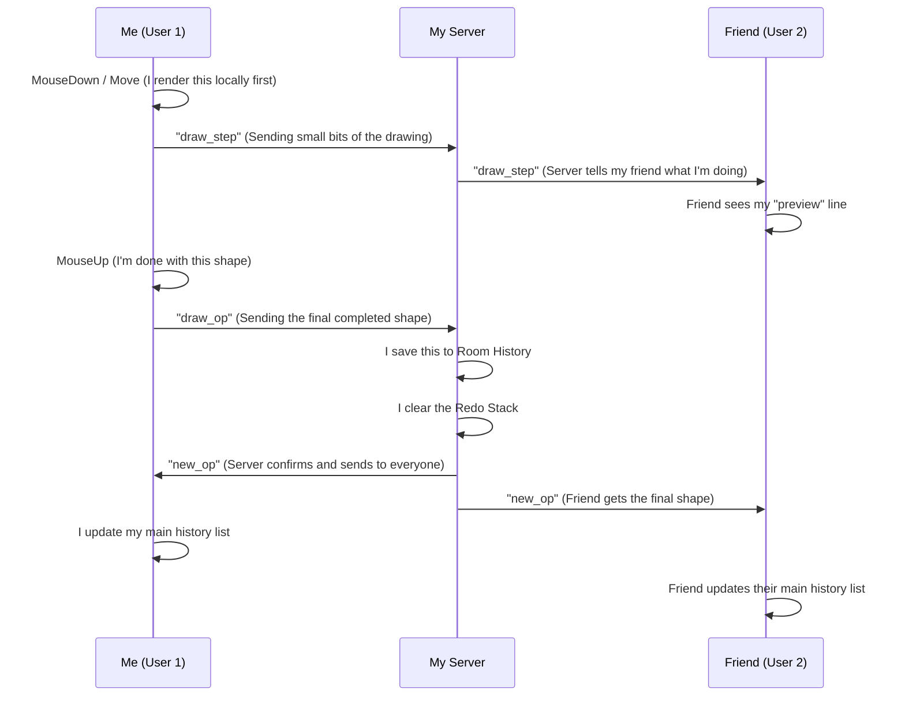

# My Project Architecture & Design

I built this app to allow multiple people to draw on a shared whiteboard in real-time. Here is how I designed the system.

## Data Flow Diagram

## WebSocket Protocol

I use Socket.io for all communication between the browser and my server.

| Event          | Direction        | What it does                                                               |
|----------------|------------------|----------------------------------------------------------------------------|
| `join_room`    | Client -> Server | I send my username and the room I want to enter.                           |
| `init_state`   | Server -> Client | The server sends me all the drawings already in that room.                 |
| `draw_step`    | Client <-> Server| Sends small segments while I'm still moving the mouse.                     |
| `draw_op`      | Client -> Server | Sends the final shape data (type, color, size) when I let go of the mouse. |
| `new_op`       | Server -> Client | Tells everyone to permanently draw a new shape on their canvas.            |
| `undo`         | Client -> Server | I request to undo my last action.                                          |
| `undo_op`      | Server -> Client | Tells all clients to remove a specific shape by its ID.                    |
| `redo`         | Client -> Server | I request to bring back the last thing I undid.                            |
| `cursor_move`  | Client -> Server | Sends my current mouse X and Y coordinates.                                |
| `cursor_update`| Server -> Client| Shows me where other people's cursors are moving.                           |

## How Undo / Redo Works

I implemented a **Global History Stack** on my Node.js server.

1.  **Saving State**: I keep an array called `drawingHistories` and another for `redoHistoryStacks` on the server.
2.  **Undo Logic**: When I click undo, the server pops the last shape from history, puts it in the redo stack, and tells everyone to delete it from their screen using the shape's ID.
3.  **Redo Logic**: When I click redo, the server takes that shape back from the redo stack and sends it out as a `new_op`.
4.  **Important**: If I start drawing a *new* shape, I clear the redo stack because the history has changed.

## Performance Decisions

-   **Two Canvas Layers**: I used two `<canvas>` elements. One for permanent drawings (the background) and one for live previews and cursors (the foreground). This way I don't have to redraw everything every time a cursor moves!
-   **Throttling Cursors**: I only send my cursor position every 50ms so I don't overwhelm the server with too many messages.
-   **Shapes over Images**: I send descriptions of shapes (like "draw a circle at 10,10") instead of sending big image files. This makes my app very fast and saves data.

## Conflict Handling

-   **Server is the Boss**: My server processes every drawing action one by one. This means if two people draw at the exact same time, the server decides which one came first and everyone gets the same order.
-   **Unique IDs**: I give every drawing a unique ID (using the timestamp and a random number) so I can easily identify and delete them during Undo.
